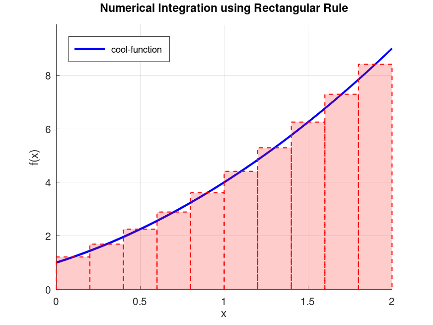
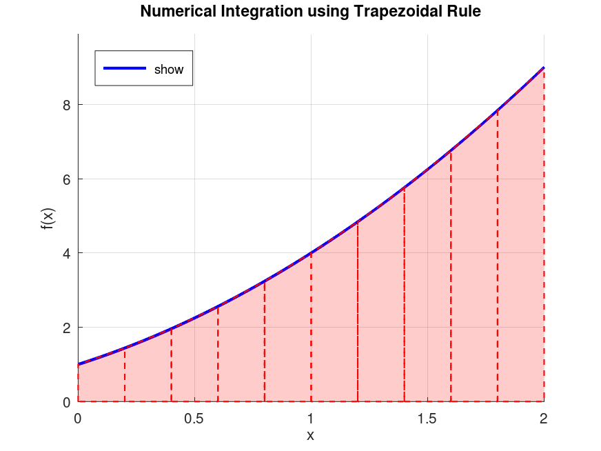
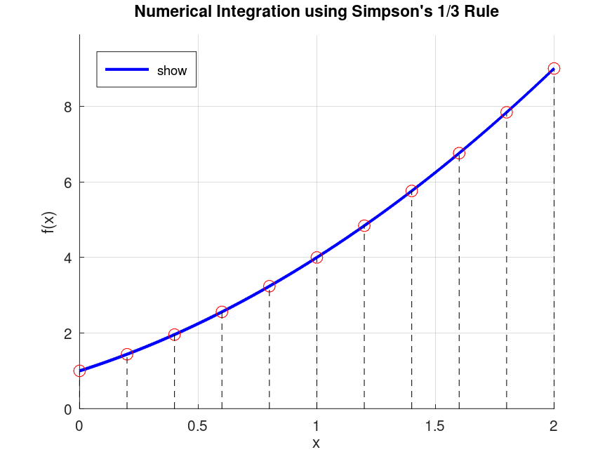
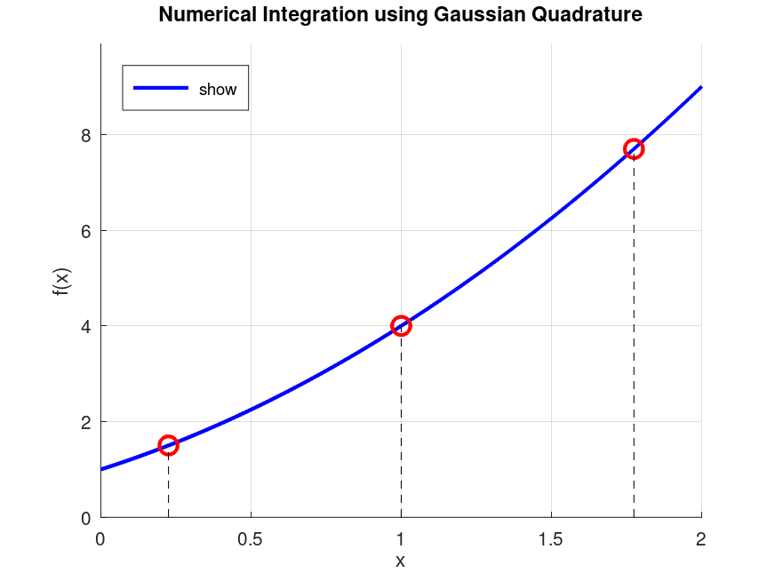

# Numerical Integration Methods - Quadrature Techniques

This repository contains implementations of various numerical methods for approximating definite integrals.

## Introduction

Numerical integration, also known as numerical quadrature, is a fundamental area of numerical analysis. It involves a family of algorithms designed to compute the approximate value of a definite integral:

$$\int_{a}^{b} f(x) \,dx$$

when an analytical solution is difficult or impossible to find. These methods are essential for solving problems in engineering, physics, statistics, and many other fields.

## Methods Implemented

This repository includes implementations of the following numerical integration methods:

### 1\. [Rectangular Rule (Midpoint Rule)](./rectangular_rule/)

This is one of the simplest methods. It approximates the area under the curve of a function by summing the areas of a series of rectangles. The height of each rectangle is determined by the function's value at the midpoint of the interval.

  * **Formula:**

  * **Characteristics:**

      * Simple to implement.
      * Relatively low accuracy compared to other methods.
      * The error is proportional to $\\frac{1}{n^2}$.

### 2\. [Trapezoidal Rule](./trapezoidal_rule/)

This method improves upon the rectangular rule by approximating the area under the curve using trapezoids instead of rectangles. It connects consecutive points on the curve with straight lines, forming a series of trapezoids.

  * **Formula:**

  * **Characteristics:**

      * More accurate than the rectangular rule.
      * The error is also proportional to $\\frac{1}{n^2}$, but with a smaller constant.

### 3\. [Simpson's Rule](./simpsons_rule/)

Simpson's rule is a more sophisticated method that approximates the function with a quadratic polynomial (a parabola) over each subinterval. This approach significantly increases the accuracy, especially for functions that are not linear.

  * **Formula:**
    Simpson's rule can be applied in two main forms:

      * **Simpson's 1/3 Rule (for an even number of subintervals, $n$):**

      * **Simpson's 3/8 Rule (for a number of subintervals, $n$, that is a multiple of 3):**

  * **Characteristics:**

      * Significantly more accurate than the rectangular and trapezoidal rules.
      * The error is proportional to $\\frac{1}{n^4}$, making it converge much faster.
      * Requires a specific number of subintervals (even for 1/3 rule, multiple of 3 for 3/8 rule).

### 4\. [Gaussian Quadrature](./gaussian_quadrature/)

Gaussian quadrature is a powerful and highly accurate method. Unlike the previous methods that use equally spaced points, Gaussian quadrature strategically chooses specific points (known as abscissas or nodes) and weights to evaluate the function. These points are chosen to provide the most accurate result for a polynomial of a given degree.

  * **Formula (for a function $g(u)$ on the interval $[-1, 1]$):**

  * **Characteristics:**

      * Extremely high accuracy for a given number of function evaluations.
      * The nodes and weights are pre-calculated and are dependent on the number of points used.
      * More complex to implement than the simpler methods.
      * Can exactly integrate a polynomial of degree up to $2n-1$ using $n$ nodes.

